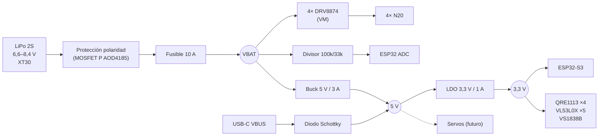
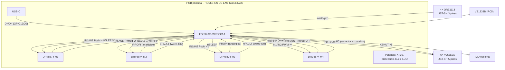

# 02 · Arquitectura eléctrica

> Borrador: el pinout es **provisional** y se cierra al diseñar la PCB en KiCad.

## Árbol de alimentación

### Presupuesto de corriente

| Carga | Raíl | Típica | Pico |
|---|---|---|---|
| 4 motores N20 (limitados por ITRIP) | VBAT | 1–3 A | 4 × 2,5 A = 10 A |
| ESP32-S3 con Wi-Fi | 3,3 V | 100 mA | 350 mA |
| 6× VL53L0X | 3,3 V | 6×10 mA | 6×20 mA |
| 4× QRE1113 (LED ~15 mA) | 3,3 V | 60 mA | 60 mA |
| VS1838B, LED de estado | 3,3 V | 5 mA | 25 mA |
| **Total 3,3 V** | | ~220 mA | **~540 mA** → LDO de 1 A ✔ |

Disipación del LDO en el peor caso: (5 − 3,3) × 0,54 ≈ 0,9 W en picos cortos. Con una media de ~0,25 W basta con un plano de cobre debajo.

## Diagrama de interconexión

## Pinout provisional (ESP32-S3-WROOM-1-N8R2)

Pines **que no se usan**:
- GPIO26–32: memoria flash/PSRAM.
- GPIO19/20: USB.
- GPIO43/44: UART de depuración.
- GPIO0/3/45/46 (strapping): se usan con cuidado o se dejan libres.

| GPIO | Señal | Tipo | Notas |
|---|---|---|---|
| 1 | LINE_FL | ADC1_CH0 | Línea delantera izquierda |
| 2 | LINE_FR | ADC1_CH1 | Línea delantera derecha |
| 4 | LINE_RL | ADC1_CH3 | Línea trasera izquierda |
| 5 | LINE_RR | ADC1_CH4 | Línea trasera derecha |
| 6 | ISENSE_M1 | ADC1_CH5 | IPROPI motor 1 (izq. delantero) |
| 7 | ISENSE_M2 | ADC1_CH6 | IPROPI motor 2 (izq. trasero) |
| 8 | ISENSE_M3 | ADC1_CH7 | IPROPI motor 3 (der. delantero) |
| 9 | ISENSE_M4 | ADC1_CH8 | IPROPI motor 4 (der. trasero) |
| 10 | VBAT_SENSE | ADC1_CH9 | Divisor 100k/33k |
| 11, 12 | M1_IN1, M1_IN2 | PWM (LEDC) | 20 kHz, fuera del rango audible |
| 13, 14 | M2_IN1, M2_IN2 | PWM | |
| 15, 16 | M3_IN1, M3_IN2 | PWM | |
| 17, 18 | M4_IN1, M4_IN2 | PWM | |
| 21 | DRV_nSLEEP | Salida | Común a los 4 drivers; resistencia a GND = motores parados al arrancar |
| 38 | DRV_nFAULT | Entrada | Open-drain común, pull-up a 3,3 V |
| 39 | I2C_SDA | I²C | Pull-up 2,2 k a 3,3 V |
| 40 | I2C_SCL | I²C | Pull-up 2,2 k a 3,3 V |
| 41 | XSHUT_L | Salida | ToF lateral izquierdo |
| 42 | XSHUT_FL | Salida | ToF frontal izquierdo |
| 47 | XSHUT_F | Salida | ToF frontal central |
| 48 | XSHUT_FR | Salida | ToF frontal derecho |
| 35 | XSHUT_R | Salida | ToF lateral derecho |
| 36 | XSHUT_B | Salida | ToF trasero (opcional) |
| 37 | IR_START | Entrada | VS1838B, decodificación RC5 |
| 3 | LED_STATUS | Salida | LED RGB WS2812 |
| 0 | BTN_BOOT / USER | Entrada | Botón BOOT, reutilizable como botón de usuario |
| 43, 44 | UART TX/RX | — | Depuración o servo futuro |
| 19, 20 | USB D−/D+ | USB | Programación y consola |

> Si faltan pines (servos, DIP de estrategia), los XSHUT pasan a un expansor I²C (TCA9534, 8 E/S) y se liberan 6 GPIO.

## Seguridad de los pines

| Señal que entra al ESP32 | Tensión máxima | Por qué es segura |
|---|---|---|
| QRE1113 | 3,3 V | Alimentado a 3,3 V |
| VL53L0X I²C | 3,3 V | Módulo alimentado a 3,3 V, pull-ups a 3,3 V |
| VS1838B | 3,3 V | Alimentado a 3,3 V |
| IPROPI | ≈ VREF (< 3,3 V) | El DRV8874 regula la corriente al llegar a VREF |
| nFAULT | 3,3 V | Open-drain con pull-up a 3,3 V |
| VBAT_SENSE | 8,4 × 33/133 = 2,1 V | Margen hasta 12,7 V antes de pasar de 3,15 V |

Los DRV8874 aceptan 3,3 V como nivel alto lógico (V_IH ≈ 1,5 V), así que no hace falta adaptación.

## Configuración del DRV8874

- **PMODE** en modo PWM (IN1/IN2): permite adelante, atrás, **freno** (ambas entradas altas) y rueda libre.
- **Límite de corriente:** `I_TRIP = V_REF / (A_IPROPI × R_IPROPI)`, con A_IPROPI ≈ 455 µA/A.
  - Ejemplo: R_IPROPI = 1 kΩ e I_TRIP = 2,5 A → V_REF ≈ 1,14 V (divisor desde 3,3 V).
  - En el ADC se lee 0–1,14 V, proporcional a 0–2,5 A.
  - Se ajusta cuando midamos la corriente de bloqueo real del N20.
- **Condensadores:** 10 µF + 100 nF cerámicos en VM de cada driver, y 2 × 22 µF / 25 V cerámicos de reserva en VBAT (más bajos que un electrolítico, que no cabía).
- **Térmica:** pad expuesto sobre plano de GND con vías térmicas hacia la cara inferior.

## Reglas para la PCB

- 2 capas, 1,6 mm, cobre de 1 oz.
- Pistas de potencia (VBAT y motores) de **≥ 1,2 mm**; pistas de señal de 0,25 mm.
- Plano de GND continuo en la cara inferior. La zona de motores y drivers va **separada** de la zona analógica (QRE e IPROPI).
- Antena del ESP32 **en el borde de la placa**, sin cobre debajo ni metal encima (ojo con la cuña de acero y el lastre).
- Serigrafía: **"HOMBRES DE LAS TABERNAS"**, logo de la jarra, nombre del robot, versión y licencia (CERN-OHL-S).
