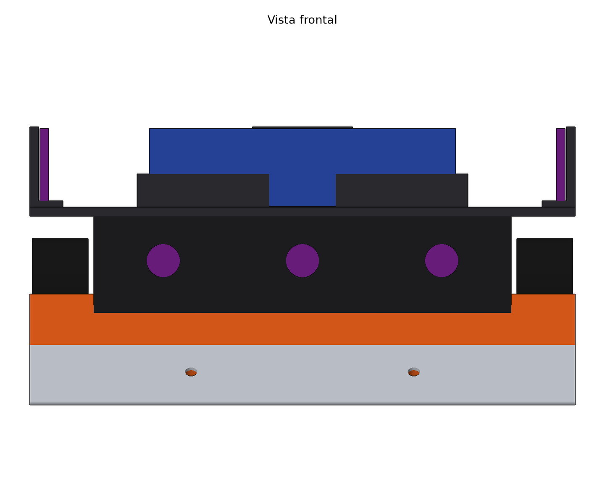

# 03 · Disposición mecánica y modelo 3D

> Modelo paramétrico: **todas las cotas salen de [`hardware/geometria.py`](../hardware/geometria.py)**. Si se cambia un parámetro (diámetro de rueda, ángulo de rampa, posición de un eje…), basta con ejecutar `hardware/generar_todo.sh` y se regeneran la PCB, el modelo 3D, los STL/STEP y estas imágenes.


## Concepto

- **Cuña de toda la vida**, con la rampa recta desde el filo hasta la PCB (~34,6°) y una **cuchilla de acero intercambiable** de 0,4 mm.
- **4WD**: dos N20 por eje, enfrentados, con ruedas de 30 mm. Todo el peso descansa sobre ruedas motrices.
- **La PCB es el chasis.** Va apoyada sobre los motores y une la pieza delantera con la trasera.
- **Masa abajo:** el lastre de acero va bajo la PCB, entre los ejes y en el canal central. La batería va arriba para cambiarla rápido.
- **Desmontable por capas:** cada capa se quita con 4–8 tornillos M2.


| Vista lateral | Vista frontal |
|---|---|
|  |  |

## Sistema de coordenadas

| Eje | Sentido | Rango |
|---|---|---|
| x | izquierda → derecha | 1 … 99 mm |
| y | **delante (filo de la cuña) → detrás** | 1 … 99 mm |
| z | suelo → arriba | 0 … 50 mm |

**Envolvente comprobada por el script: 98 × 98 × 50,1 mm**. Deja 1 mm de margen por lado sobre los 100 × 100 del reglamento; la altura no tiene límite.

## Niveles

| z (mm) | Qué hay |
|---|---|
| 0 – 1,5 | Filo de la cuchilla; QRE1113 a ~1,7 mm del suelo |
| 1,5 – 20 | **Pieza frontal** (rampa + cuna delantera), **pieza trasera** (cuna + parachoques), **lastre**, **motores** (eje a 15 mm) |
| 20 – 21,6 | **PCB** (74 × 62 mm) apoyada sobre los motores y las cunas |
| 21,6 – 34 | **Paredes de la carcasa**: componentes de la PCB, 3 ToF frontales tras sus ventanas |
| 34 – 35,6 | **Techo** (98 × 74 mm, también cubre las ruedas) |
| 35,6 – 50 | **Batería** en su bahía, ToF laterales y trasero en sus soportes, receptor IR |

## Piezas

| # | Pieza | Fabricación | Material | Cant. | Masa est. | Ficheros |
|---|---|---|---|---|---|---|
| 1 | Frontal: rampa + cuna delantera | FDM, plana sin soportes | PETG, 40 % de relleno | 1 | 40 g | `stl/frontal_rampa_cuna.stl` |
| 2 | Trasera: cuna + parachoques | FDM, plana sin soportes | PETG, 40 % | 1 | 23 g | `stl/trasera_cuna_parachoques.stl` |
| 3 | Paredes de la carcasa | FDM, de pie | PETG, 30 % | 1 | 5 g | `stl/carcasa_paredes.stl` |
| 4 | Techo (bahía de batería y soportes de ToF) | FDM, boca abajo | PETG, 30 % | 1 | 10 g | `stl/carcasa_techo.stl` |
| 5 | Llanta | FDM o resina | PLA o resina dura, 100 % | 4 | 4,6 g | `stl/llanta.stl` |
| 6 | Neumático | Silicona colada en molde de resina (v2) | Silicona 20–30 Shore A | 4 | 3,6 g | — (de momento, ruedas N20 comerciales) |
| 7 | Cuchilla | Chapa cortada y doblada | Acero de fleje / galga de 0,4 mm | 1 | 5,6 g | `step/robot_ensamblaje.step` |
| 8 | Lastre central | Corte de pletina | Acero (o plomo) | 1 | 65 g | ídem |
| 9 | Lastres del canal (delantero y trasero) | Corte de pletina | Acero (o plomo) | 2 | 63 g + 45 g | ídem |
| — | PCB | JLCPCB | FR4 1,6 mm | 1 | 27 g montada | [`hardware/pcb`](../hardware/pcb) |

Todas las piezas están en **STEP** en `hardware/mecanica/step/`, para abrir en Onshape o FreeCAD. El ensamblaje completo es `robot_ensamblaje.step` y el documento de FreeCAD, `hardware/mecanica/cad/robot_sumo.FCStd`.

## Dónde va cada sensor

| Sensor | Posición (x, y, z) | Montaje | Conector en la PCB |
|---|---|---|---|
| ToF frontal izq. / central / der. | x = 25 / 50 / 75; y ≈ 27; z ≈ 26 | Tras las ventanas de la pared frontal | J8 / J9 / J10 |
| ToF lateral izq. / der. | x ≈ 3 / 97; y = 64; z ≈ 43 | Soportes en el techo; ven por encima de las ruedas | J7 / J11 (el cable sube por una ranura del techo) |
| ToF trasero | x = 50; y ≈ 96; z ≈ 43 | Soporte trasero en el techo | J12 |
| Línea delanteros | x = 17 / 83; y = 22; z ≈ 1,7 | Alojamientos abiertos por abajo en la rampa | J13 / J14 |
| Línea traseros | x = 25 / 75; y = 94; z ≈ 1,7 | Alojamientos en el parachoques | J15 / J16 |
| Receptor IR (RC5) | x = 50; y = 89; arriba del todo | Sobre el techo, a la vista del juez | J17 |

## Masa (estimada por el script)

| Grupo | Masa |
|---|---|
| Lastre (3 bloques de acero) | 173 g |
| Pieza frontal + cuchilla + QRE | 47 g |
| 4 motores N20 | 40 g |
| 4 ruedas (llanta + neumático) | 33 g |
| Batería LiPo 2S | 32 g |
| PCB montada | 27 g |
| Pieza trasera + QRE | 24 g |
| Techo + ToF + IR | 13 g |
| Paredes + ToF frontales | 8 g |
| **Total** | **≈ 396 g** |

Quedan **~100 g de margen hasta 500 g**. Faltan cables, tornillos y pegamento (unos 15–20 g), así que la cifra real rondará los 415 g. Para llegar a ~490 g:

1. **Cambiar el lastre de acero por plomo**: el mismo volumen pesa ×1,44, unos +75 g. Es lo más eficaz porque el peso queda bajo y entre los ejes.
2. Imprimir las cunas al 100 % de relleno (+10 g).
3. Ajuste fino al final, **con báscula**, con arandelas en los tornillos del lastre.

## Tornillería

| Uso | Tornillo | Cant. | Dónde rosca |
|---|---|---|---|
| Techo + paredes + PCB → cunas (esquinas) | M2 × 18 DIN 912 | 4 | Inserto de latón M2 en la cuna |
| PCB → cunas (centrales) | M2 × 6 DIN 912 | 4 | Inserto de latón M2 en la cuna |
| Cuchilla → rampa | M2 × 5 avellanado DIN 965 | 2 | Inserto de latón M2 en la rampa |
| Insertos roscados M2 (Ø 3,2 × 4 mm) | — | 10 | Se colocan con el soldador |

Los motores no llevan abrazadera: quedan atrapados entre su alojamiento de la cuna y la PCB al apretar los tornillos.

## Orden de montaje

1. Colocar los insertos en las cunas y la rampa con el soldador.
2. Montar los QRE1113 en sus alojamientos (abiertos por abajo) y pasar los cables por los taladros verticales.
3. Meter los **motores** en las cunas (reductora hacia fuera) y el **lastre** en el canal central y entre las cunas.
4. Soldar los cables de los motores a la PCB: suben por los pads M1–M4.
5. Apoyar la **PCB** y atornillar los 4 M2 × 6 centrales.
6. Poner las **paredes** con los ToF frontales ya colocados tras sus ventanas.
7. Poner el **techo** con los ToF laterales y trasero y el receptor IR, y atornillar los 4 M2 × 18 de las esquinas.
8. Montar las **ruedas** (a presión en el eje D de 3 mm), la **cuchilla** y la **batería** (velcro + cinta).

## Impresión

| Pieza | Orientación | Notas |
|---|---|---|
| Frontal y trasera | Cara inferior (z = 1,5) sobre la cama | Sin soportes: los alojamientos se abren hacia arriba o hacia abajo. 4 perímetros. |
| Paredes | De pie, como van montadas | Sin soportes; las ventanas de los ToF son de 6 mm |
| Techo | Boca abajo (el techo sobre la cama) | El reborde de la bahía y los soportes crecen hacia arriba |
| Llantas | Planas | 100 % de relleno; probar el ajuste al eje D antes de imprimir las 4 |

## Limitaciones conocidas (para la v2)

- **Los ToF frontales izquierdo y derecho miran al frente**, no en abanico: no hay fondo suficiente para girarlos sin chocar con la PCB. Lo compensa el firmware con la posición de cada uno. En la v2 se pueden girar ±20° en las esquinas achaflanadas.
- Las cunas solo dejan **~0,9 mm de pared** entre el inserto trasero exterior y el alojamiento del motor. Si se agrieta al imprimir, mover los taladros traseros (`TALADROS` en `geometria.py`) o usar insertos cortos.
- **Componentes de la PCB representados como prismas**: KiCad no tiene instaladas las librerías 3D (`kicad-library-3d`, ~5 GB). Con ellas, el STEP de la PCB sale con todos los modelos reales.
- El paso de cables está solo esbozado (taladros y ranuras). Se ajusta con la primera impresión.

## Regenerar

```bash
hardware/generar_todo.sh
```

Hace, en orden: esquemático + PCB con ERC/DRC → STEP de la PCB → modelo 3D en FreeCAD (`freecadcmd`) → comprobación de interferencias y masas (`mecanica/cad/informe_3d.json`) → imágenes de `docs/img/`.
