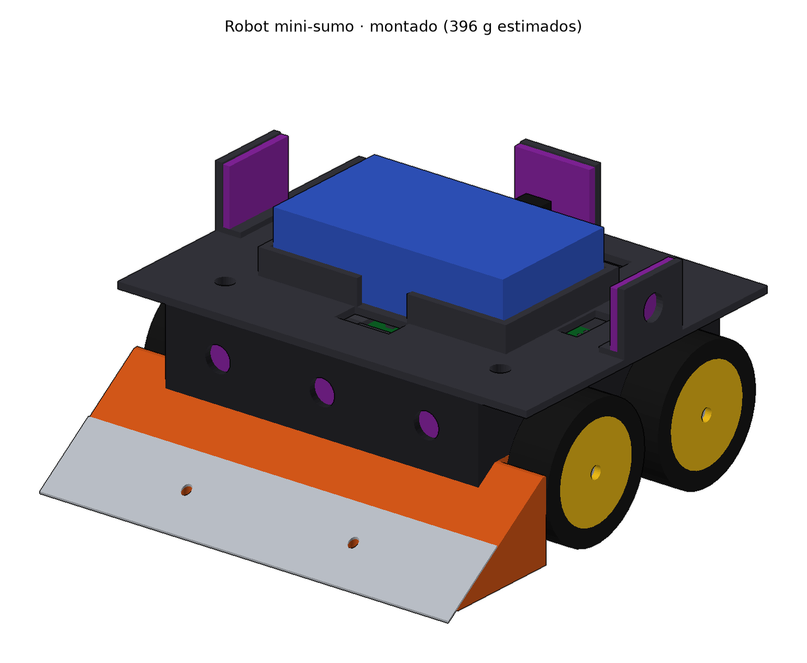
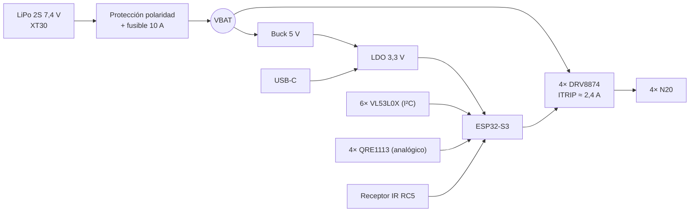
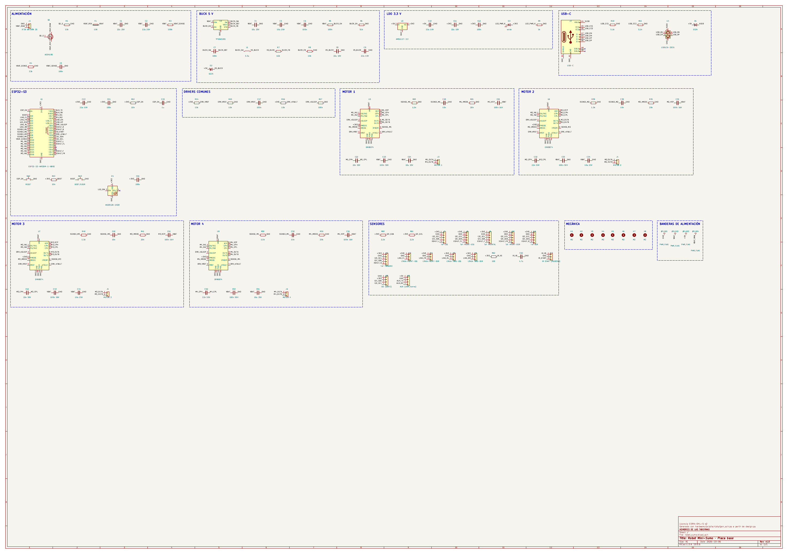
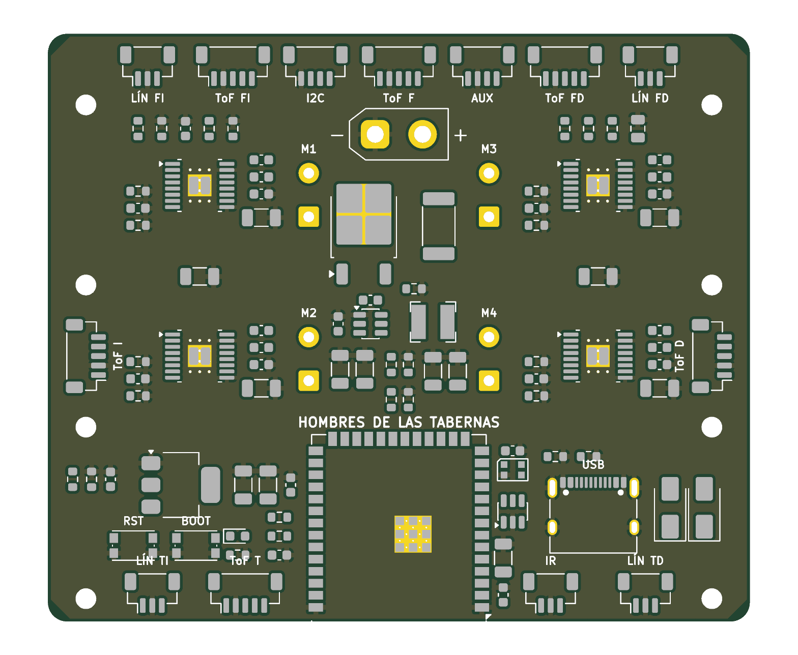
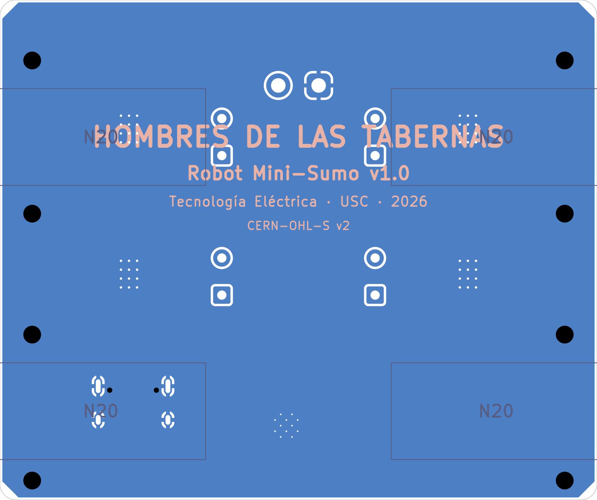
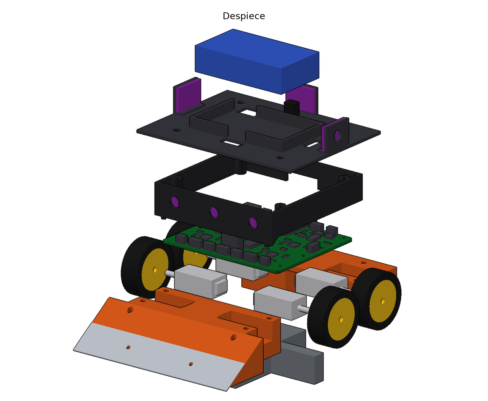
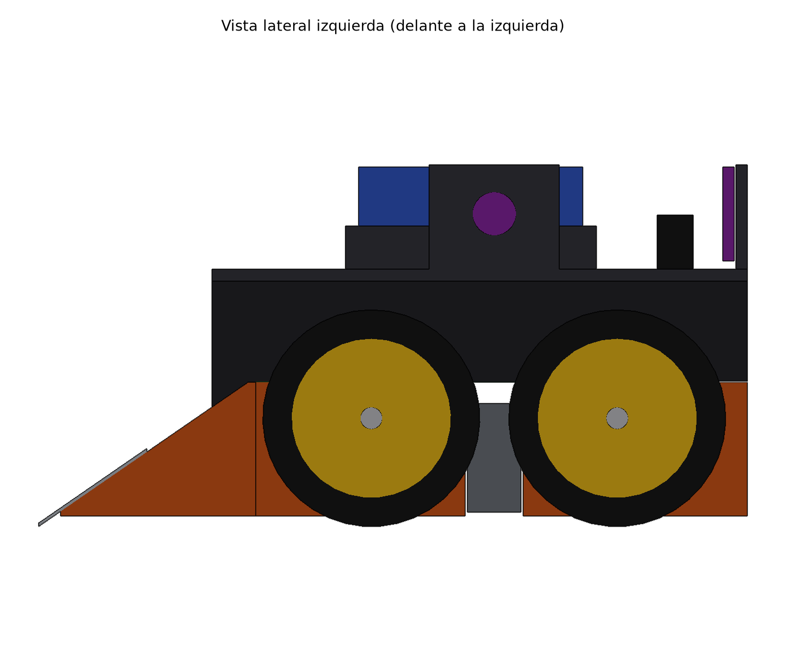
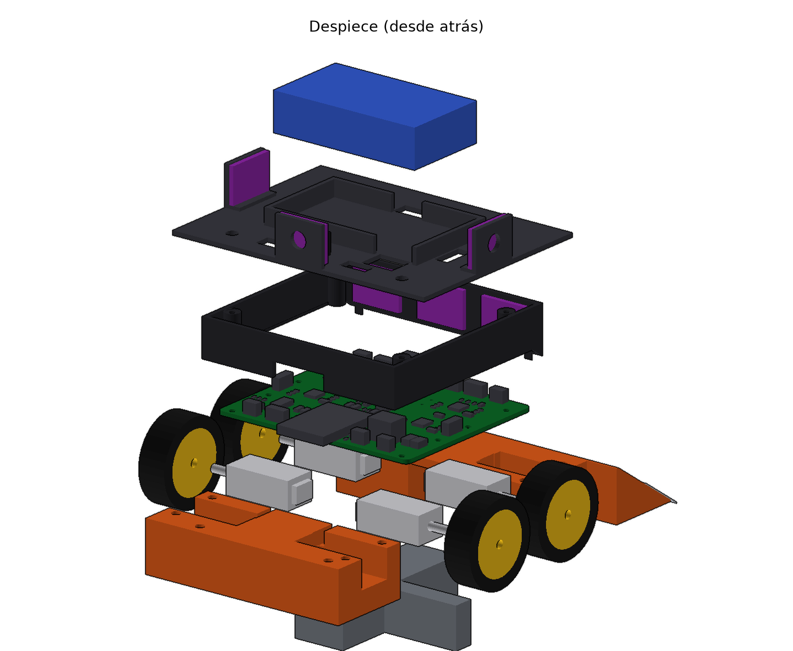

# Informe de progreso · 6 de octubre de 2026

**Equipo:** Hombres de las Tabernas (Mateo, Paulo, Mario)
**Para:** el equipo, para ponernos al día y revisar lo hecho
**Autoría:** diseño y documentación generados con Claude (asistente de IA) a partir del boceto y las instrucciones de Mateo. **Todo está pendiente de revisión humana**: la sección [Qué revisar](#13-qué-revisar-antes-de-pedir-nada) lista los puntos menos seguros.

---

## 0. Resumen en 30 segundos

- **Robot:** cuña clásica, **4 ruedas motrices (4 × N20)**, **ESP32-S3**, **PCB propia que es también el chasis**, 6 sensores de distancia ToF, 4 de línea y arranque por mando IR (obligatorio en el reglamento).
- **Hecho hoy:**
  - Selección de componentes argumentada.
  - Arquitectura eléctrica.
  - **Esquemático completo en KiCad** (ERC sin errores).
  - **PCB con todos los componentes colocados** (falta rutar).
  - **Modelo 3D desmontable** en FreeCAD, con STL listos para imprimir y STEP para Onshape.
  - Todo **se regenera solo** desde dos ficheros de parámetros.
- **Cumple el reglamento** en el modelo: 98 × 98 × 50 mm y ~396 g estimados (más ~20 g de cables y tornillos).
- **Presupuesto estimado:** **~83 € lo imprescindible**, algo por encima del límite de 80 €. Hay recortes fáciles (cargador del laboratorio, sin repuestos); ver [lista de compra](#6-lista-de-compra).
- **Siguiente gran paso:** **rutar la PCB** y pedirla a JLCPCB. Hay [5 problemas abiertos](#9-problemas-abiertos-y-riesgos) que conviene resolver antes.



---

## 1. Qué hay en el repositorio

| Ruta | Qué es |
|---|---|
| [`docs/00-Requisitos-y-reglamento.md`](00-Requisitos-y-reglamento.md) | Resumen del reglamento OSHWDem y de los requisitos de la asignatura |
| [`docs/01-Seleccion-de-componentes.md`](01-Seleccion-de-componentes.md) | **Por qué** cada pieza y no otra |
| [`docs/02-Arquitectura-electrica.md`](02-Arquitectura-electrica.md) | Alimentación, conexiones, pinout del ESP32, seguridad de pines |
| [`docs/03-Disposicion-mecanica.md`](03-Disposicion-mecanica.md) | Piezas, niveles, masas, tornillería, montaje, impresión |
| `docs/img/` | Todas las imágenes de este informe |
| [`hardware/geometria.py`](../hardware/geometria.py) | **Parámetros mecánicos** (una sola fuente para PCB y 3D) |
| [`hardware/pcb/scripts/design.py`](../hardware/pcb/scripts/design.py) | **El circuito** (componentes y conexiones, fuente única) |
| `hardware/pcb/robot_sumo.kicad_pro` | Proyecto KiCad (abrirlo con KiCad 10) |
| `hardware/pcb/bom.csv` | Lista de materiales de la PCB en formato JLCPCB |
| `hardware/mecanica/stl/` | Piezas listas para imprimir |
| `hardware/mecanica/step/` | Piezas y ensamblaje en STEP (Onshape/FreeCAD) |
| `hardware/mecanica/cad/robot_sumo.FCStd` | Documento de FreeCAD con todas las piezas |
| [`hardware/generar_todo.sh`](../hardware/generar_todo.sh) | Regenera **todo** (≈1 min) |

> ⚠️ **No se editan a mano** el `.kicad_sch` ni los STL: se generan. Para cambiar el circuito se toca `design.py`; para cambiar medidas, `geometria.py`. Después se ejecuta `hardware/generar_todo.sh`. **Excepción:** el rutado de la PCB sí se hará a mano en KiCad (ver §10).

---

## 2. Cronología del proceso

| # | Paso | Resultado |
|---|---|---|
| 1 | Lectura del enunciado, las diapositivas del profe y el boceto (cuña + logo de la jarra) | Lista de preguntas para el equipo |
| 2 | Lectura del **reglamento OSHWDem rev. 7** | Descubrimos que el **arranque por mando IR (RC5) es obligatorio** y que los **imanes están prohibidos**. La altura es ilimitada. |
| 3 | Selección de componentes con alternativas | [01](01-Seleccion-de-componentes.md) |
| 4 | Arquitectura eléctrica y pinout | [02](02-Arquitectura-electrica.md) |
| 5 | Símbolo propio del **DRV8874** (KiCad no lo trae), con el pinout sacado del datasheet de TI | `hardware/pcb/lib/Sumo.kicad_sym` |
| 6 | **Esquemático generado por script** desde `design.py` | ERC: **0 errores, 0 avisos** |
| 7 | Geometría mecánica (ruedas, motores, PCB, taladros) | `geometria.py` |
| 8 | **Colocación de la PCB** por bloques, varias iteraciones con DRC | Sin solapes; falta rutar |
| 9 | **Modelo 3D en FreeCAD** generado desde la misma geometría | 0 interferencias entre piezas |
| 10 | Rediseños para que **se pueda imprimir sin soportes** | Carcasa dividida en paredes + techo; fondo de las cunas plano |
| 11 | Renderizador propio para las imágenes y script `generar_todo.sh` | Imágenes de `docs/img/` |

Commits: `f1cf324` (estructura y docs) → `a9e89b0` (esquemático + PCB) → `81eb0a8` (3D + doc mecánica).

---

## 3. Decisiones clave (y por qué)

| Decisión | Alternativa descartada | Motivo |
|---|---|---|
| **ESP32-S3-WROOM-1** soldado en nuestra PCB | Arduino Nano, ESP32 clásico, placa DevKit | USB nativo (sin CH340), 10 entradas analógicas que funcionan con Wi-Fi, ~30 pines libres. Hace de la PCB una placa base de verdad. |
| **Un DRV8874 por motor** | L298N, TB6612FNG | **Limita la corriente por hardware (~2,4 A)**: si el motor se bloquea empujando, ni el driver ni el motor se queman. Además mide la corriente (detección de contacto con el rival). |
| **4WD con 4 N20** (el boceto tenía 2 ruedas) | 2WD | En sumo el límite es el **agarre**: con 4WD todo el peso empuja. Cabe en 100 mm. |
| **LiPo 2S 7,4 V** con XT30 | 18650, pila de 9 V | Ligera y potente. Los muelles de los portapilas 18650 rebotan con los golpes y reinician el ESP32. |
| **Todo lo que habla con el ESP32 a 3,3 V** | Adaptadores de nivel | Así es imposible meter 5 V en un pin. |
| **6 ToF VL53L0X** (3 delante, 2 laterales, 1 detrás) | Sensores IR digitales JS40F | Los JS40F son mejores pero cuestan ~12 € cada uno. Los ToF a ~1,7 € cubren las salidas de frente, de lado y de espaldas del reglamento. |
| **PCB = chasis** apoyada **encima** de los motores | PCB como tapa | Cuenta como estructura propia y deja la cara inferior plana. La PCB tiene 74 × 62 mm, menos de 100 × 100 (precio mínimo en JLC). |
| **Antena del ESP32 asomando** por detrás de la PCB | Zona sin cobre dentro de la placa | La zona libre que pide Espressif (48 × 15 mm) se comía media placa. |
| **Sin interruptor**: se enciende al enchufar el XT30 | Interruptor con MOSFET | Hacía falta sitio. Es lo habitual en minisumo. |
| **Conectores JST-SH** (1 mm) SMD | JST-PH (2 mm) | 13 conectores PH no cabían. |
| **Carcasa en dos piezas** (paredes + techo) | Una pieza | De una pieza no se puede imprimir sin soportes. |
| **Lastre de acero/plomo** bajo la PCB | Sin lastre | Masa = empuje. Va abajo y entre los ejes. |

---

## 4. Electrónica

### Esquema de bloques



### Esquemático (KiCad)

Organizado por bloques: alimentación, buck, LDO, USB, ESP32, 4 drivers y sensores. Cada pin lleva una etiqueta con su red, así que no hay cables cruzados. **ERC limpio.**



### PCB (colocada, **sin rutar**)

| Cara superior (render 3D de KiCad) | Cara inferior |
|---|---|
|  |  |

- 74 × 62 mm, 2 capas, plano de GND en las dos caras.
- Serigrafía **"HOMBRES DE LAS TABERNAS"**, obligatoria por la asignatura: grande en la cara inferior y pequeña en la superior. Cada conector lleva su etiqueta (ToF F, LÍN FI, M1…).
- Reglas de diseño de JLCPCB (pista y separación mínimas de 0,15 mm, vías de 0,3 mm). Pistas de potencia de 1 mm para batería y motores.
- **Estado del DRC:** 189 conexiones sin rutar (lo normal hasta rutar) y 54 avisos menores (holguras de taladros y serigrafía) pendientes de limpiar al rutar.

---

## 5. Mecánica y 3D



| Vista lateral | Despiece visto desde atrás |
|---|---|
|  |  |

**Capas, de abajo arriba:**
1. Pieza frontal (rampa + cuna delantera) con cuchilla de acero.
2. Pieza trasera (cuna trasera + parachoques).
3. Lastre.
4. Motores.
5. PCB.
6. Paredes de la carcasa con los 3 ToF frontales.
7. Techo con la bahía de la batería, los ToF laterales y trasero y el receptor IR.
8. Batería.

| Pieza imprimible | Fichero | Orientación | Masa |
|---|---|---|---|
| Frontal (rampa + cuna) | `stl/frontal_rampa_cuna.stl` | Plana, sin soportes | 40 g |
| Trasera (cuna + parachoques) | `stl/trasera_cuna_parachoques.stl` | Plana, sin soportes | 23 g |
| Paredes | `stl/carcasa_paredes.stl` | De pie | 5 g |
| Techo | `stl/carcasa_techo.stl` | Boca abajo | 10 g |
| Llanta (× 4) | `stl/llanta.stl` | Plana, 100 % de relleno | 4,6 g |

**Masa estimada: ~396 g** (lastre 173 g · frontal 47 · motores 40 · ruedas 33 · batería 32 · PCB 27 · trasera 24 · techo 13 · paredes 8). Para acercarse a 490 g: **lastre de plomo en lugar de acero** (+75 g) y ajuste final con báscula. Detalle en [03](03-Disposicion-mecanica.md).

---

## 6. Lista de compra

> ⚠️ **Precios orientativos** (AliExpress/LCSC, octubre 2026), **no comprobados en tienda**. Hay que revisarlos al pedir. **Imprescindible** = sin eso no hay robot; **Extra** = repuestos o mejoras.

### 6.1 AliExpress (módulos, motores, batería, mecánica)

| Artículo | Qué buscar | Cant. | ~€ | Tipo |
|---|---|---|---|---|
| Motor N20 con reductora metálica | "N20 gear motor 6V 500RPM" (eje D de 3 mm) | 4 | 12,0 | Imprescindible |
| Ruedas para N20 | "N20 rubber wheel 30mm" o 34 mm (cambiar `RUEDA_D` en `geometria.py`) | 4 | 3,0 | Imprescindible |
| Batería LiPo 2S | "2S 7.4V 450mAh XT30", **≤ 55 × 31 × 14 mm** | 1 | 7,0 | Imprescindible |
| Sensor ToF VL53L0X | **Módulo pequeño (~13 × 18 mm)**, no el GY-530 de 25 mm (ver §9) | 6 | 10,2 | Imprescindible |
| Sensor de línea QRE1113 | "QRE1113 analog line sensor" (~8 × 14 mm) | 4 | 4,0 | Imprescindible |
| Receptor IR 38 kHz | "VS1838B" (pack de 10) | 1 | 1,0 | Imprescindible |
| Cables JST-SH 1,0 mm ya crimpados | "JST SH 1.0 cable 3pin/4pin/5pin" (packs de 10) | 3 packs | 4,0 | Imprescindible |
| Cable de silicona 22 AWG | Para motores y batería | 2 m | 2,0 | Imprescindible |
| Tornillos M2 + insertos de latón M2 | Kit "M2 heat set insert" + M2 × 6/18 DIN 912 + 2 × M2 × 5 avellanados | kit | 5,0 | Imprescindible |
| Galga de espesores 0,4 mm o fleje | Para la cuchilla | 1 | 3,0 | Imprescindible |
| Segunda batería 2S | Igual que la primera | 1 | 7,0 | Extra (recomendable para el torneo) |
| Cargador LiPo con balanceo 2S | "B3AC" (~6 €) o "iMAX B6" (~20 €) | 1 | 6,0 | **Solo si no hay en el laboratorio** |
| ESP32-S3-WROOM-1-**N8R2** de repuesto | Ojo: **no R8** | 1 | 3,5 | Extra |
| Motor N20 de repuesto | | 1 | 3,0 | Extra |
| Silicona RTV 20–30 Shore A | Neumáticos propios (v2) | 1 | 8,0 | Extra (v2) |

### 6.2 LCSC + JLCPCB (componentes de la PCB y la placa, mismo envío)

Lista completa con referencias en [`hardware/pcb/bom.csv`](../hardware/pcb/bom.csv). Resumen:

| Componente | Ref. | Cant. | ~€ |
|---|---|---|---|
| ESP32-S3-WROOM-1-N8R2 | U1 | 1 | 3,5 |
| DRV8874PWPR (+2 de repuesto) | U5–U8 | 4 (+2) | 6,0 (+3,0) |
| TPS563201DDCR (buck) | U2 | 1 | 0,4 |
| AMS1117-3.3 | U3 | 1 | 0,1 |
| USBLC6-2SC6 (protección USB) | U4 | 1 | 0,2 |
| AOD4185 (MOSFET P) | Q1 | 1 | 0,3 |
| SS34 | D1, D2 | 2 | 0,1 |
| USB-C vertical XKB U262-16XN-4BVC11 | J2 | 1 | 0,4 |
| XT30UPB-M (macho, vertical) + XT30 hembra con cable para la batería | J1 | 1 + 1 | 1,0 |
| JST-SH BM05B / BM04B / BM03B-SRSS-TB | J7–J19 | 6 / 2 / 5 | 2,0 |
| Inductor SRN4018-3R3M | L1 | 1 | 0,2 |
| Fusible 2512 10 A | F1 | 1 | 0,3 |
| Pulsadores KMR2, WS2812B-2020, LED 0603 | SW2, SW3, D3, D4 | 4 | 0,7 |
| Resistencias 0603 (11 valores) y condensadores 0603/0805/1206 | — | ~70 | 2,0 |
| **PCB JLCPCB** 2 capas, 74 × 62 mm, 5 unidades | — | 5 | 2,0 |
| **Envío** LCSC + JLC juntos | — | — | 8,0 |
| *Plantilla de pasta (stencil)* | — | 1 | *7,0 (extra)* |

### 6.3 Ferretería, tienda local o laboratorio

| Artículo | Para qué | ~€ |
|---|---|---|
| Pletina de acero (~20 × 14 mm) o plomo de pesca | Lastre | 3–5 |
| Filamento PETG (~100 g) | Piezas impresas | Laboratorio |
| Velcro adhesivo + brida | Sujetar la batería | 1 |

### 6.4 Total

| Bloque | Imprescindible | Con extras |
|---|---|---|
| AliExpress | ~51 € | ~78 € (con cargador y silicona) |
| LCSC + JLC (incl. envío) | ~28 € | ~38 € (con repuestos y stencil) |
| Local | ~4 € | ~5 € |
| **Total** | **~83 €** | ~121 € |

**Estamos algo por encima de 80 €.** Formas de recortar, por orden:
1. Cargador del laboratorio (0 €).
2. Una sola batería al principio.
3. Pedir solo 4 DRV8874, sin repuestos (−3 €).
4. 5 ToF en lugar de 6, quitando el trasero (−1,7 €).
5. Reutilizar tornillería del laboratorio.

> 💡 **Cuándo pedir:** lo de AliExpress puede pedirse **ya** (tarda 2–3 semanas). Lo de LCSC/JLC, **después de rutar y revisar la PCB**.

---

## 7. Útiles y herramientas necesarias

| Herramienta | Para qué | ¿Imprescindible? |
|---|---|---|
| Soldador de punta fina + flux + malla de desoldar | Todo el SMD (0603, SOT-23, JST-SH) | Sí |
| **Estación de aire caliente o placa calefactora** | **El pad térmico del DRV8874 (×4) no se suelda con soldador.** El ESP32 sí, con paciencia. | **Sí** (o encargar el montaje a JLC) |
| Pasta de soldar (+ stencil) | Con aire caliente o placa | Recomendable |
| Lupa o microscopio USB | Revisar puentes en el HTSSOP (paso 0,65 mm) y el JST-SH | Recomendable |
| Multímetro | Continuidad, tensiones, cortos antes de conectar | Sí |
| **Fuente de laboratorio con límite de corriente** | Primer encendido sin batería y **medir la corriente de bloqueo de los N20** | Sí (laboratorio) |
| Cargador LiPo con balanceo + **bolsa ignífuga** | Seguridad de la batería | Sí |
| Báscula de 0,1 g | Ajustar el peso a < 500 g | Sí |
| Calibre | Comprobar medidas reales de módulos y motores | Sí |
| Punta de soldador para insertos M2 | Colocar insertos de latón en el PETG | Recomendable |
| Impresora FDM con PETG | Piezas | Sí (laboratorio) |
| Impresora de resina | Llantas y moldes de neumáticos (v2) | Opcional |
| Tijera de chapa, lima, alicates | Cuchilla y lastre | Sí |
| Llave Allen de 1,5 mm | Tornillos M2 | Sí |
| Cable USB-C de datos | Programar el ESP32 | Sí |

**Software (Linux):** KiCad 10 ✅ instalado · FreeCAD 1.1 ✅ instalado · Arduino IDE o PlatformIO (pendiente) · Onshape en el navegador (opcional, para editar en equipo).

---

## 8. Problemas encontrados hoy y cómo se resolvieron

| Problema | Solución |
|---|---|
| El **reglamento obliga a arrancar con mando IR (RC5)**; no lo teníamos previsto | Receptor VS1838B + decodificador RC5 en el firmware (pendiente) |
| KiCad **no trae el DRV8874** | Símbolo propio con el pinout del datasheet de TI y huella HTSSOP-16 estándar |
| La huella del DRV8874 trae **vías de 0,2 mm** y JLC no las fabrica en 2 capas | Huella sin vías + 12 vías de 0,3 mm añadidas por script |
| La **zona libre de la antena del ESP32** ocupaba medio robot | El módulo asoma 6 mm por detrás de la PCB |
| Los componentes ocupaban **~70 % de la placa** (muy difícil de rutar a 2 capas) | Quitado el interruptor, conectores JST-PH → JST-SH, electrolítico → cerámicos, pulsadores más pequeños |
| El USB-C horizontal chocaba con los taladros de las esquinas | USB-C **vertical**, enchufable desde arriba |
| Las **paredes de la carcasa** apoyaban sobre los conectores laterales | J7/J11 movidos hacia dentro |
| Carcasa y cunas **no imprimibles sin soportes** | Carcasa en dos piezas; fondo de las cunas plano |
| KiCad 10 + Python 3.14: fallo de SWIG al recorrer elementos | Parche de compatibilidad en los scripts |
| KiCad sin tablas de librerías globales hasta la primera apertura | `check.sh` usa una configuración propia temporal |
| matplotlib dibujaba mal la profundidad en 3D | Renderizador propio con z-buffer |

---

## 9. Problemas abiertos y riesgos

| # | Problema | Gravedad | Propuesta |
|---|---|---|---|
| 1 | **Las patillas de anclaje del USB-C atraviesan la PCB justo encima del motor trasero derecho** (se ve en la imagen de la cara inferior) | 🔴 Hay que resolverlo antes de pedir | Mover J2 al canal central o a la zona entre ejes, o hacer un rebaje en la cuna |
| 2 | **Tamaño de los módulos VL53L0X:** el diseño asume módulos de ~13 × 18 mm. El típico GY-530 mide ~25 × 11 mm y **no cabe** tras la pared frontal | 🔴 Afecta a la compra | Comprar el módulo pequeño o rediseñar los soportes. **Medir antes de comprar en cantidad.** |
| 3 | **Rutado de la PCB:** placa densa a 2 capas | 🟠 | Rutar a mano en KiCad, potencia primero. Si no sale, subir a 4 capas (JLC ~+5 €) |
| 4 | **Soldar el DRV8874** (pad térmico) | 🟠 | Aire caliente o placa calefactora, o montaje en JLC (~+10 €) |
| 5 | **Corriente de bloqueo real del N20** desconocida | 🟠 | Medirla con la fuente en cuanto lleguen y ajustar ITRIP (R20/R30/R40/R50) |
| 6 | Los ToF frontales izq./der. **miran al frente**, no en abanico | 🟡 | Compensar en el firmware; girarlos en la v2 |
| 7 | Pared de ~0,9 mm entre el inserto trasero exterior y el motor | 🟡 | Ver en la primera impresión; mover el taladro si se agrieta |
| 8 | **Peso:** ~415 g reales previstos | 🟡 | Plomo en lugar de acero + báscula |
| 9 | Batería de ~55 × 31 × 14 mm supuesta | 🟡 | Medir la que se compre; la bahía se ajusta en `robot.py` |
| 10 | El AMS1117 puede calentarse con el Wi-Fi activo (hasta ~0,9 W en picos) | 🟡 | Plano de cobre; si se calienta, cambiarlo por un buck a 3,3 V |
| 11 | Falta el **logo** en la serigrafía (solo va el nombre) | 🟡 | Pasar el dibujo de la jarra a imagen limpia en blanco y negro para convertirlo en KiCad |

---

## 10. Próximos pasos

| Paso | Qué | Sugerencia de responsable |
|---|---|---|
| 1 | **Revisar este informe y la [lista de §13](#13-qué-revisar-antes-de-pedir-nada)** | Todos |
| 2 | Resolver los problemas abiertos 1 (USB-C) y 2 (tamaño de los ToF) | Mateo |
| 3 | **Rutar la PCB** en KiCad y dejar el DRC limpio | Mateo |
| 4 | **Pedir lo de AliExpress** (no depende de la PCB) | Quien tenga la cuenta |
| 5 | Imprimir una **primera prueba** de frontal y trasera en PLA para comprobar los motores | Paulo / Mario |
| 6 | Logo en la serigrafía y pedido a JLCPCB + LCSC | Mateo |
| 7 | Firmware: lectura de sensores, RC5, control de motores, telemetría Wi-Fi | Por decidir |
| 8 | Docs 04 (PCB), 05 (compra definitiva), 06 (costes) e informe final de 6 páginas | Por decidir |

*El reparto es solo una propuesta; lo decidimos entre los tres.*

---

## 11. Preguntas abiertas para el equipo

1. ¿Hay **cargador de LiPo con balanceo** y **aire caliente o placa calefactora** en el laboratorio?
2. ¿Confirmamos **4WD** (4 motores) en lugar de las 2 ruedas del boceto?
3. ¿Quién tiene el **logo** en buena calidad?
4. ¿Montamos la PCB **nosotros** o pagamos el **montaje en JLC** (~+10 €, sin problemas con el DRV8874)?
5. ¿Creamos ya el repositorio en **GitHub** para trabajar los tres?

---

## 12. Cómo trabajar con el proyecto

```bash
# Regenerar todo (esquemático, PCB, 3D, STL/STEP, imágenes) tras cambiar geometria.py o design.py
hardware/generar_todo.sh

# Solo la lista de materiales
python3 hardware/pcb/scripts/gen_bom.py
```

- **Abrir la PCB:** KiCad 10 → `hardware/pcb/robot_sumo.kicad_pro`. La primera vez, aceptar "copiar las tablas de librerías por defecto".
- **Abrir el 3D:** FreeCAD → `hardware/mecanica/cad/robot_sumo.FCStd`, o subir `step/robot_ensamblaje.step` a Onshape.
- **Docs en Obsidian:** abrir la carpeta del proyecto como bóveda.

> ⚠️ **Al rutar a mano en KiCad**, no volver a ejecutar `gen_pcb.py`: regeneraría la PCB **sin pistas**. A partir del rutado, los cambios de circuito se hacen en `design.py` → `gen_sch.py`, y en KiCad con *Herramientas → Actualizar PCB desde esquemático* (las huellas están enlazadas al esquemático).

---

## 13. Qué revisar antes de pedir nada

Estos son los puntos en los que tengo **menos certeza** y que conviene que alguien compruebe con los datasheets:

- [ ] **Buck TPS563201:** el inductor (3,3 µH) y los condensadores de salida los puse por experiencia, **no los comprobé con el datasheet**. Revisar la tabla de componentes recomendados de TI y el umbral del pin EN (divisor 100 k / 51 k).
- [ ] **USB-C vertical XKB U262:** comprobar que el pinout de la huella de KiCad coincide con el modelo exacto que se compre.
- [ ] **AOD4185 (TO-252):** comprobar puerta/drenador/fuente frente a la huella y que el montaje protege de verdad contra la inversión de polaridad.
- [ ] **DRV8874:** el pinout y los valores (VCP 100 nF, CPH-CPL 22 nF, IMODE 20 k, R_IPROPI 1,5 k, VREF 1,65 V) salen del datasheet de TI. Revisar igualmente la tabla 1 y las ecuaciones 1–3.
- [ ] **Pinout del ESP32-S3:** los pines de arranque (GPIO0, 3, 45, 46) y que con la variante **N8R2** los GPIO35–37 estén libres.
- [ ] **Medidas de los módulos** (ToF, QRE1113, batería, ruedas): el 3D usa medidas típicas. **Medir con calibre** lo que se compre.
- [ ] **Precios** de la lista de compra: son estimaciones.
- [ ] **XT30:** que la batería que se compre traiga el XT30 **hembra** (la PCB lleva el macho).
